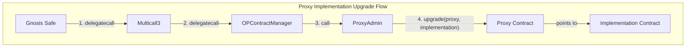
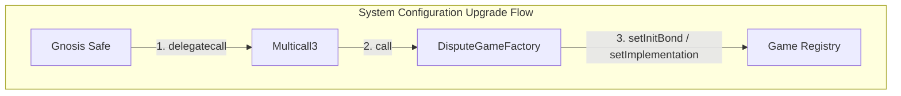

### Why We Need This Tool

This tool is necessary to execute L1 OP core smart contract upgrade transactions on Celo that require a `delegatecall` from a Gnosis Safe multisig wallet.

## Types of Upgrades Supported

This tool supports two main categories of upgrades:

1. **Proxy Implementation Upgrades (v2, v3):** Upgrades that change the implementation of OP Stack proxy contracts via OPContractManager (OPCM)
2. **System Configuration Upgrades (succinct, succinct-v102):** Upgrades that configure the fault proof system by registering or updating game implementations in the DisputeGameFactory

Both types require `delegatecall` from the Gnosis Safe, but follow slightly different execution flows.

## Smart Contracts Involved

*   **Gnosis Safe:** A multisig wallet that holds the ultimate ownership and control over the upgrade process. It is responsible for initiating all upgrade transactions through `delegatecall`.
*   **ProxyAdmin:** The contract responsible for managing the upgradeability of the OP Stack's proxy contracts. It has the authority to change the implementation address of a proxy, thereby upgrading the contract's logic. The `ProxyAdmin` is owned by the Gnosis Safe.
*   **OPContractManager (OPCM):** A dedicated contract that orchestrates proxy implementation upgrades. It is designed to be called by the Gnosis Safe via `delegatecall` and, in turn, calls the `ProxyAdmin` to perform the actual upgrades.
*   **Multicall3:** A utility contract that allows batching multiple calls in a single transaction. Used for both OPCM upgrades and DisputeGameFactory configuration.
*   **DisputeGameFactory:** The contract responsible for managing fault proof game implementations. It registers game types and their associated implementations for the OP Stack's dispute resolution system.
*   **Proxy Contracts:** These are the actual OP Stack contracts that handle the core logic (e.g., `L1CrossDomainMessenger`, `OptimismPortal2`). They point to an implementation contract, and the `ProxyAdmin` can update this pointer to a new implementation.

## Upgrade Execution Flows

### Type 1: Proxy Implementation Upgrades (v2, v3)

These upgrades change the implementation addresses of OP Stack proxy contracts:

The critical step in this process is the `delegatecall` chain from the Gnosis Safe through Multicall3 to the OPCM. Here's why:

The `ProxyAdmin` contract is owned by the Gnosis Safe. This means that any call to `ProxyAdmin` to perform an upgrade must originate from the Gnosis Safe. A standard `call` from the `OPCM` to the `ProxyAdmin` would make the `OPCM` the `msg.sender`. Since the `OPCM` is not the owner of the `ProxyAdmin`, this would cause the transaction to fail the ownership check and revert.

By using `delegatecall` from the Gnosis Safe to Multicall3, and then from Multicall3 to the `OPCM`, the Gnosis Safe's execution context (including `msg.sender`) is preserved throughout the entire call chain. As a result, when the `OPCM` subsequently calls the `ProxyAdmin`, the `msg.sender` is still the Gnosis Safe. This satisfies the ownership check, allowing the upgrade to proceed securely.

### Type 2: System Configuration Upgrades (succinct, succinct-v102)

These upgrades configure the fault proof system by registering or updating game implementations:

These upgrades are simpler than proxy implementation upgrades:
- **succinct upgrade:** Registers the OP Succinct game type (42) with `setInitBond()` and `setImplementation()`
- **succinct-v102 upgrade:** Updates the game implementation to v1.0.2 with `setImplementation()` only

While these don't involve the ProxyAdmin, they still require `delegatecall` to Multicall3 because:
1. The DisputeGameFactory is owned by the Gnosis Safe
2. Multicall3 allows batching multiple operations (e.g., setInitBond + setImplementation) in a single transaction
3. The Gnosis Safe's execution context must be preserved for ownership checks

## The Problem: Gnosis Safe UI Restrictions

The Gnosis Safe UI imposes certain restrictions on executing transactions with `delegatecall`:

1.  **Single Transactions:** The UI no longer permits a direct `delegatecall` for a single transaction. This is a security measure introduced following exploits on other platforms (specifically ByBit).
2.  **Batch Transactions:** While the UI allows batching transactions where the initial call is a `delegatecall` to a `MultiSend` contract, the `MultiSend` contract itself then executes the individual transactions within the batch using a standard `call`.

This creates a problem for both upgrade types:
- **For OPCM upgrades:** We cannot use single transaction mode (delegatecall disabled) or batch mode (would call OPCM with `call` instead of `delegatecall`), breaking the ownership chain
- **For DisputeGameFactory upgrades:** We cannot batch operations like setInitBond + setImplementation without `delegatecall` to Multicall3

## The Solution

The scripts in this repository solve this problem by providing a way to construct, sign, and execute upgrade transactions correctly, ensuring that:

1. **For OPCM upgrades:** The call chain uses `delegatecall` from Gnosis Safe → Multicall3 → OPCM, preserving the execution context for ProxyAdmin ownership checks
2. **For DisputeGameFactory upgrades:** Operations are batched via `delegatecall` to Multicall3, maintaining the Gnosis Safe context for ownership verification

This enables all types of Celo OP Stack upgrades to be managed securely through the Gnosis Safe multisig governance process, working around the UI limitations while maintaining proper authorization and security.