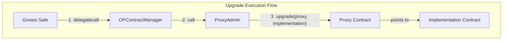

### Why We Need This Tool

This tool is necessary to execute L1 OP core smart contract upgrade transactions on Celo that require a `delegatecall` from a Gnosis Safe multisig wallet.

To understand why this tool is needed, let's first look at the smart contracts involved in the upgrade process:

*   **Gnosis Safe:** A multisig wallet that holds the ultimate ownership and control over the upgrade process. It is responsible for initiating the upgrade transaction.
*   **OPContractManager (OPCM):** A dedicated contract that orchestrates the upgrade. It is designed to be called by the Gnosis Safe and, in turn, calls the `ProxyAdmin` to perform the actual upgrades.
*   **ProxyAdmin:** The contract responsible for managing the upgradeability of the OP Stack's proxy contracts. It has the authority to change the implementation address of a proxy, thereby upgrading the contract's logic. The `ProxyAdmin` is owned by the Gnosis Safe.
*   **Proxy Contracts:** These are the actual OP Stack contracts that handle the core logic (e.g., `L1CrossDomainMessenger`). They point to an implementation contract, and the `ProxyAdmin` can update this pointer to a new implementation.

The upgrade process follows a specific sequence of calls, as illustrated below:

The critical step in this process is the `delegatecall` from the Gnosis Safe to the `OPCM`. Here's why:

The `ProxyAdmin` contract is owned by the Gnosis Safe. This means that any call to `ProxyAdmin` to perform an upgrade must originate from the Gnosis Safe. A standard `call` from the `OPCM` to the `ProxyAdmin` would make the `OPCM` the `msg.sender`. Since the `OPCM` is not the owner of the `ProxyAdmin`, this would cause the transaction to fail the ownership check and revert.

By using `delegatecall`, the Gnosis Safe's execution context (including `msg.sender`) is preserved when it calls the `OPCM`. As a result, when the `OPCM` subsequently calls the `ProxyAdmin`, the `msg.sender` is still the Gnosis Safe. This satisfies the ownership check, allowing the upgrade to proceed securely.

The Gnosis Safe UI, however, imposes certain restrictions on executing transactions with `delegatecall`:
1.  **Single Transactions:** The UI no longer permits a direct `delegatecall` for a single transaction. This is a security measure introduced following exploits on other platforms (specifically ByBit).
2.  **Batch Transactions:** While the UI allows batching transactions where the initial call is a `delegatecall` to a `MultiSend` contract, the `MultiSend` contract itself then executes the individual transactions within the batch using a standard `call`.

This creates a problem:
- We cannot use the single transaction option because `delegatecall` is disabled.
- We cannot use the batch transaction option because it ultimately invokes the `OPCM` with a `call`, not the required `delegatecall` which makes the ownership check fail.

The scripts in this repository solve this problem by providing a way to construct, sign, and execute the upgrade transaction correctly, ensuring that the `OPCM` is called with `delegatecall` as required, thereby enabling the Celo upgrade process to be managed securely by the Gnosis Safe.
